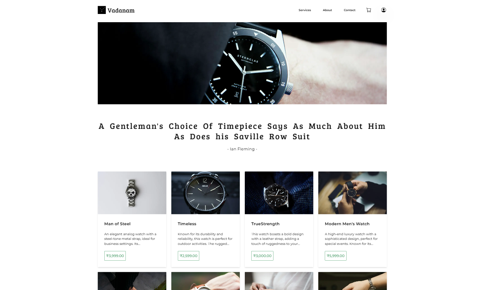

# Next Js Ecommerce Platform



## Description

Ecommerce Platform made with NextJS framework using Server Components with Prisma ORM and MongoDB Atlas as database.Tailwind CSS is used with Daisy UI for elegant User Interface design.
AuthJS is used to implement authentication and authorization with credentials and github OAuth.
<br>
This project is deployed on vercel hobby's plan.It can also be used as template just replace data with any product data you like. Make sure to update prisma schema.

## Tech Stack

1. NextJs
2. Prisma ORM
3. MongoDB Atlas
4. Tailwind CSS
5. Daisy UI
6. AuthJs
7. Github OAuth

## Usage

```bash

git clone https://github.com/WebDevloper1971/ecomm-nextjs-public.git

cd ecomm-nextjs-public

/* IMP :  add the environment variables */

npm run dev

```

Open [http://localhost:3000](http://localhost:3000) with your browser to see the result.

## Learn More

To learn more about Next.js, take a look at the following resources:

- [Next.js Documentation](https://nextjs.org/docs) - learn about Next.js features and API.
- [Learn Next.js](https://nextjs.org/learn) - an interactive Next.js tutorial.

You can check out [the Next.js GitHub repository](https://github.com/vercel/next.js) - your feedback and contributions are welcome!

## Deploy on Vercel

The easiest way to deploy your Next.js app is to use the [Vercel Platform](https://vercel.com/new?utm_medium=default-template&filter=next.js&utm_source=create-next-app&utm_campaign=create-next-app-readme) from the creators of Next.js.

Check out our [Next.js deployment documentation](https://nextjs.org/docs/app/building-your-application/deploying) for more details.

<br>

## Message

Feel free to clone the repo and try new things
<br>
Happy Coding 😃
